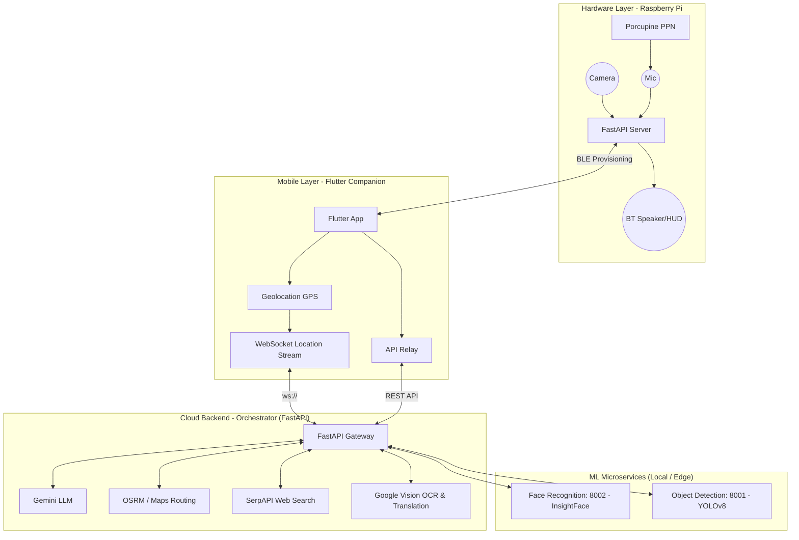

<div align="center">
  

  <h3>Situational Awareness & Guidance Engine</h3>

  <p align="center">
    <a href="https://git.io/typing-svg">
      
    </a>
  </p>

  <p align="center">
    
    
    
    
    
  </p>
</div>

<br/>

<div align="center">
  
</div>

## ✨ Overview

**S.A.G.E** is a software-first, modular smartglass system pushing the limits of wearable AI. By offloading heavy ML workloads and orchestration to a mobile app and hosted backend, S.A.G.E keeps the hardware footprint minimal while delivering a powerful AR experience through a lightweight HUD.

### 🌟 Core Capabilities
- 👁️ **Continuous Object Detection**: Environmental awareness and spatial obstacle identification using YOLOv8s.
- 🧑‍🤝‍🧑 **Facial Recognition**: Seamless real-time individual identification and enrollment via InsightFace.
- 🗺️ **Turn-by-Turn Navigation**: Real-time routing via OSRM and Google Directions APIs, streamed over WebSockets.
- 🗣️ **Gemini Voice Assistant**: Hands-free intelligence seamlessly integrated with Porcupine wake-word and Google Cloud STT/TTS.
- 🔍 **Live Web Search**: Fast, live internet querying powered by SerpAPI.
- 🌍 **OCR & Translation**: Text recognition (Google Vision) combined with on-the-fly translation (LibreTranslate).

<div align="center">
  
</div>

## 🏗 System Architecture

The ecosystem relies on an asynchronous distributed microservice architecture spanning hardware, mobile, and cloud environments.



<div align="center">
  
</div>

## 📂 Codebase Structure

The repository is logically separated into focused sub-domains:

| Folder | Components | Stack | Description |
|---|---|---|---|
| 📱 `app/frontend/` | Mobile App | Dart / Flutter | Companion UI. Handles BLE pairing, GPS tracking (`geolocator`), and WebSockets. |
| ⚙️ `app/backend/` | Backend Orchestrator | Python / FastAPI | Core gateway. Routes traffic to ML, handles active Navigation sessions, and Web Search. |
| 🧠 `ml/` | ML Inference | PyTorch / YOLOv8 | Dedicated microservices for Face Recognition and Object Detection inferences. |
| 🍓 `sage/` | Pi Hardware Runtime | Python / BlueZ | On-device scripts for wake-word listeners, audio routing, and Pi FastAPI hardware control. |

<div align="center">
  
</div>
## 👩‍💻 The Team

Meet the brains behind S.A.G.E:

| Member | Role | Key Contributions (from Git History) |
| :--- | :--- | :--- |
| **Navneet** | Mobile / Systems Engineer 🟦 | Flutter UI & Dashboard, BLE/WiFi network provisioning, Pi Server initialization, Hardware I/O (STT/TTS/Camera), and full-stack Dockerization. |
| **Gayathri** | Core Backend Architect 🟩 | FastAPI Orchestrator, intelligent multi-intent routing (Gemini v2.5-flash), WebSocket turn-by-turn navigation integrations, and cross-module TTS logic. |
| **Nikhil** | ML / Cloud Engineer 🟥 | Face Recognition inference & endpoints, OCR setup, built the LibreTranslate & Google Cloud integrations for seamless translation logic. |
| **Ananya** | ML / API Engineer 🟧| YOLO Object detection pipeline & spatial grid mapping, SerpAPI live web search integrations, and Google Maps routing implementations. |

<div align="center">
  
</div>
##  Getting Started

To spin up the updated S.A.G.E ecosystem locally:

### 1. Backend & ML Services (Docker Recommended)
Ensure you configure your `app/backend/.env` with `SERPAPI_API_KEY`, `GOOGLE_MAPS_API_KEY`, and Gemini keys respectively.

```bash
# Core Backend
cd app/backend
docker-compose up -d

# ML Services (Face Rec & Object Detection on 8002 & 8001)
cd ../../ml/facial-recognition && docker-compose up -d
cd ../object-detection && docker-compose up -d
```

### 2. Raspberry Pi Hardware Scripts
Follow the setup guides inside `sage/scripts/` to register systemd services. Ensure your picovoice `hey-sage-wake-up-train.ppn` is linked.
```bash
cd sage/scripts
chmod +x *.sh
./install_pi_server.sh
```

### 3. Flutter Companion App
Ensure Flutter 3.10+ is installed.
```bash
cd app/frontend
flutter pub get
flutter run
```

<div align="center">
  
</div>

<p align="center">
  <i>S.A.G.E is built with ❤️ for smarter interactions and accessible AI.</i>
</p>
